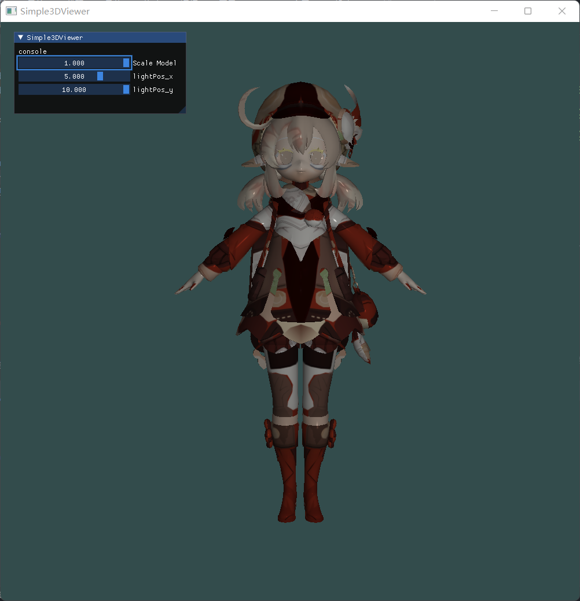
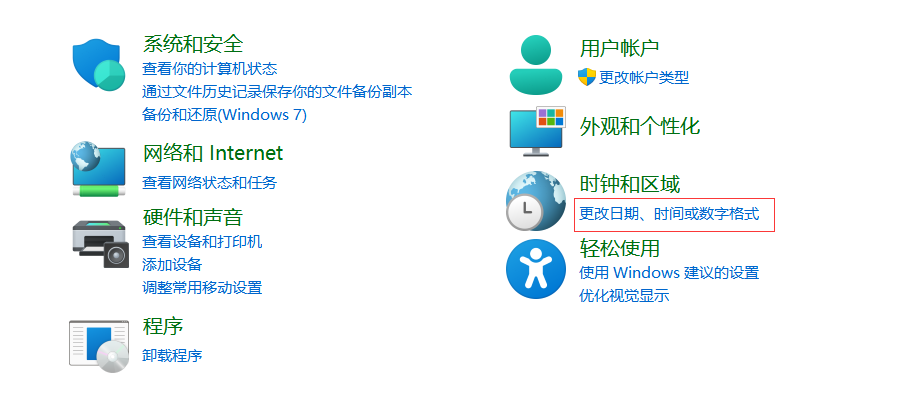
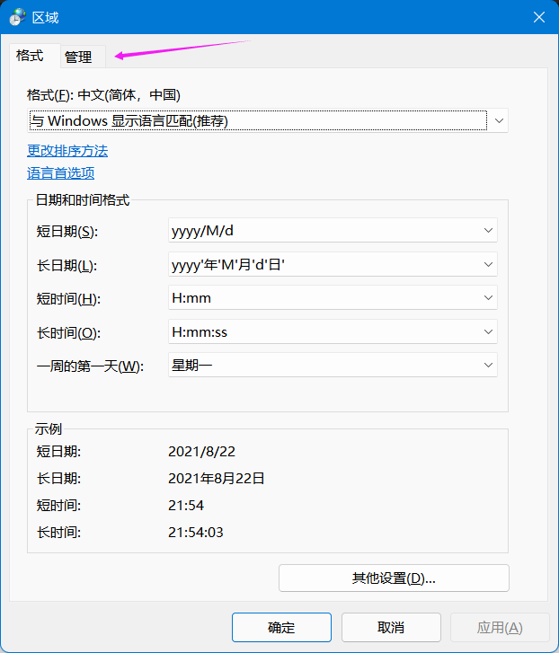
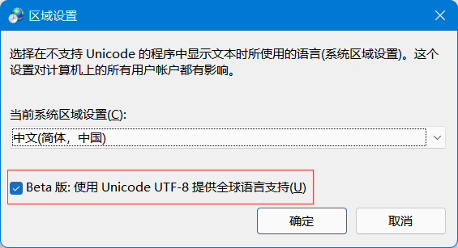

# Simpler3DViewer



Simpler3DViewer可以用来简单的查看一下3D模型，支持的模型类型请查看[Assimp](https://github.com/assimp/assimp).

##  环境搭建

本程序的运行平台为windows11，编译器为MSVC，IDE为Clion。

需要环境如下：

* assimp5.0.1
* imgui
* glfw3
* glad
* opengl3
* glm

1. 下载vcpkg：创建安装目录，运行下面命令。

   ``` shell
   > git clone https://github.com/microsoft/vcpkg
   > .\vcpkg\bootstrap-vcpkg.bat
   ```

   将安装目录添加到环境变量中。

2. 安装第三方库：运行下面命令

   ```shell
   >vcpkg install assimp:x64-windows
   >vcpkg install imgui[opengl3-glad-binding]:x64-windows
   >vcpkg install glm:x64-windows
   >vcpkg install glfw3:x64-windows
   ```

3. 使用Clion的话需要在文件->设置->cmake->cmake选项中加入下面指令：

   ```
   -DCMAKE_TOOLCHAIN_FILE=[your vcpkg root]/scripts/buildsystems/vcpkg.cmake
   ```

   如果使用VS2019,请自行查阅[vcpkg的文档](https://github.com/microsoft/vcpkg#quick-start-windows)

##  一些注意的地方

1. 如果模型路径有中文，请务必将windows路径设为utf-8编码，设置方法如下：

   打开控制面板

   

   点击更改日期、时间或数字格式
   
   

   点击管理，点击更改系统区域设置，勾选Beta版:使用Unicode UTF-8提供全球语言支持
   
   

